    library(readr)
    library(dplyr)

    ## 
    ## Attaching package: 'dplyr'

    ## The following objects are masked from 'package:stats':
    ## 
    ##     filter, lag

    ## The following objects are masked from 'package:base':
    ## 
    ##     intersect, setdiff, setequal, union

    library(expss)

    ## Warning: package 'expss' was built under R version 4.1.2

    ## Loading required package: maditr

    ## 
    ## To get total summary skip 'by' argument: take_all(mtcars, mean)

    ## 
    ## Attaching package: 'maditr'

    ## The following objects are masked from 'package:dplyr':
    ## 
    ##     between, coalesce, first, last

    ## The following object is masked from 'package:readr':
    ## 
    ##     cols

    ## 
    ## Attaching package: 'expss'

    ## The following objects are masked from 'package:dplyr':
    ## 
    ##     compute, contains, na_if, recode, vars

    library(ggplot2)

    ## 
    ## Attaching package: 'ggplot2'

    ## The following object is masked from 'package:expss':
    ## 
    ##     vars

    library(tidyverse)

    ## ── Attaching packages ─────────────────────────────────────── tidyverse 1.3.1 ──

    ## ✓ tibble  3.1.2     ✓ stringr 1.4.0
    ## ✓ tidyr   1.1.3     ✓ forcats 0.5.1
    ## ✓ purrr   0.3.4

    ## ── Conflicts ────────────────────────────────────────── tidyverse_conflicts() ──
    ## x maditr::between()  masks dplyr::between()
    ## x maditr::coalesce() masks dplyr::coalesce()
    ## x maditr::cols()     masks readr::cols()
    ## x expss::compute()   masks dplyr::compute()
    ## x tidyr::contains()  masks expss::contains(), dplyr::contains()
    ## x dplyr::filter()    masks stats::filter()
    ## x maditr::first()    masks dplyr::first()
    ## x stringr::fixed()   masks expss::fixed()
    ## x purrr::keep()      masks expss::keep()
    ## x dplyr::lag()       masks stats::lag()
    ## x maditr::last()     masks dplyr::last()
    ## x purrr::modify()    masks expss::modify()
    ## x purrr::modify_if() masks expss::modify_if()
    ## x expss::na_if()     masks dplyr::na_if()
    ## x tidyr::nest()      masks expss::nest()
    ## x expss::recode()    masks dplyr::recode()
    ## x stringr::regex()   masks expss::regex()
    ## x purrr::transpose() masks maditr::transpose()
    ## x ggplot2::vars()    masks expss::vars(), dplyr::vars()
    ## x purrr::when()      masks expss::when()

    library(data.table)

    ## 
    ## Attaching package: 'data.table'

    ## The following object is masked from 'package:purrr':
    ## 
    ##     transpose

    ## The following objects are masked from 'package:expss':
    ## 
    ##     copy, like

    ## The following objects are masked from 'package:maditr':
    ## 
    ##     copy, dcast, melt

    ## The following objects are masked from 'package:dplyr':
    ## 
    ##     between, first, last

    library(rsample)

    ## 
    ## Attaching package: 'rsample'

    ## The following object is masked from 'package:expss':
    ## 
    ##     contains

    library(caret)

    ## Loading required package: lattice

    ## 
    ## Attaching package: 'caret'

    ## The following object is masked from 'package:purrr':
    ## 
    ##     lift

    library(modelr)
    library(parallel)
    library(foreach)

    ## 
    ## Attaching package: 'foreach'

    ## The following objects are masked from 'package:purrr':
    ## 
    ##     accumulate, when

    ## The following object is masked from 'package:expss':
    ## 
    ##     when

-   1.  

<!-- -->

    ABIA <- read_csv("/Users/jirapat/Desktop/R/Data Mining/ABIA.csv")

    ## 
    ## ── Column specification ────────────────────────────────────────────────────────
    ## cols(
    ##   .default = col_double(),
    ##   UniqueCarrier = col_character(),
    ##   TailNum = col_character(),
    ##   Origin = col_character(),
    ##   Dest = col_character(),
    ##   CancellationCode = col_character()
    ## )
    ## ℹ Use `spec()` for the full column specifications.

    ABIA$DepartureHour <- round(ABIA$DepTime/100, 0)

    ABIA <- ABIA %>% mutate(Month_label = ifelse(ABIA$Month %in% c(12, 1, 2), "Winter", ifelse(ABIA$Month %in% c(3, 4, 5), "Spring", ifelse(ABIA$Month %in% c(6, 7, 8), "Summer", "Fall"))))

-   What is the best time of day to fly to minimize delays The best time
    of the day to fly to minimize delays is 5am., 6am., and 7am.
    respectively.

<!-- -->

    ABIA %>% group_by(DepartureHour) %>% summarise(mean_dep_delay = mean(DepDelay, na.rm=TRUE)) %>% arrange(mean_dep_delay)

    ## # A tibble: 26 x 2
    ##    DepartureHour mean_dep_delay
    ##            <dbl>          <dbl>
    ##  1             5         -3.50 
    ##  2             6         -2.40 
    ##  3             7         -0.944
    ##  4             8          0.131
    ##  5             9          4.01 
    ##  6            11          5.12 
    ##  7            10          5.98 
    ##  8            13          7.07 
    ##  9            12          7.61 
    ## 10            15          8.97 
    ## # … with 16 more rows

-   Does this change by airline? for most airlines, such as 9E (Endeavor
    Air), B6 (JetBlue), CO (Copa Airline), DL (Delta Airline), and WN
    (SouthWest Airline) show least delay between 5am., 6am., and 7am.

<!-- -->

    mean_delay_by_hours <- ABIA %>% group_by(DepartureHour, UniqueCarrier) %>% summarise(mean_dep_delay = mean(DepDelay, na.rm=TRUE)) %>% arrange(mean_dep_delay)

    ## `summarise()` has grouped output by 'DepartureHour'. You can override using the `.groups` argument.

    mean_delay_by_hours

    ## # A tibble: 341 x 3
    ## # Groups:   DepartureHour [26]
    ##    DepartureHour UniqueCarrier mean_dep_delay
    ##            <dbl> <chr>                  <dbl>
    ##  1             5 AA                    -11.2 
    ##  2             6 B6                    -10.1 
    ##  3             5 US                     -6.14
    ##  4             5 YV                     -5.81
    ##  5             6 NW                     -5.6 
    ##  6            18 US                     -5.56
    ##  7            19 NW                     -5.42
    ##  8            12 NW                     -5.17
    ##  9             7 B6                     -4.92
    ## 10             6 OO                     -3.83
    ## # … with 331 more rows

    ggplot(mean_delay_by_hours) + geom_col(aes(x=DepartureHour, y=mean_dep_delay)) + facet_wrap(~UniqueCarrier) + labs(title = "Mean Departure Delay Each Hour by Airline") + xlab("Departure Time") + ylab("Mean Departure Delay")

    ## Warning: Removed 15 rows containing missing values (position_stack).

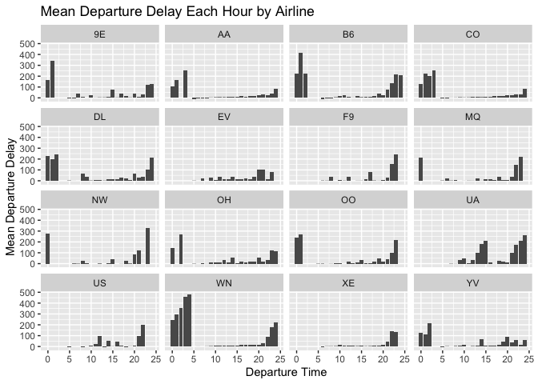

-   What is the best time of year to fly to minimize delays For
    simplicity, let’s group the months together by seasons for the ease
    of analysis. The bar graph shows that average departure delay is
    highest in Spring and Winter which makes sense intuitively since
    those are holiday seasons. In contrast, the average departure delay
    is least in Fall since it is when school is starting and so most
    people are not flying.

<!-- -->

    mean_dep_delay_by_season <- ABIA %>% group_by(Month_label, Dest) %>% summarise(mean_dep_delay = mean(DepDelay, na.rm=TRUE)) %>% arrange(mean_dep_delay) 

    ## `summarise()` has grouped output by 'Month_label'. You can override using the `.groups` argument.

    mean_dep_delay_by_season

    ## # A tibble: 190 x 3
    ## # Groups:   Month_label [4]
    ##    Month_label Dest  mean_dep_delay
    ##    <chr>       <chr>          <dbl>
    ##  1 Fall        SNA            -7.5 
    ##  2 Fall        SEA            -4.5 
    ##  3 Winter      MSP            -3.5 
    ##  4 Winter      TUL            -3.46
    ##  5 Spring      CLT            -3.08
    ##  6 Summer      DTW            -3   
    ##  7 Fall        MEM            -2.93
    ##  8 Fall        SJC            -1.75
    ##  9 Fall        BOS            -1.68
    ## 10 Spring      JAX            -1.47
    ## # … with 180 more rows

    ggplot(mean_dep_delay_by_season, aes(Month_label, mean_dep_delay)) + geom_col()

    ## Warning: Removed 2 rows containing missing values (position_stack).

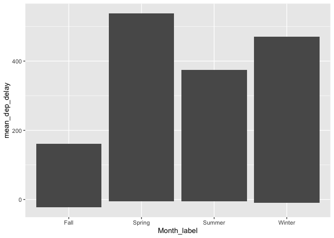

-   Does this change by destination? (You’d probably want to focus on a
    handful of popular destinations.) By grouping flying activities by
    destinations and sorting the data we observed that the top 6 most
    popular destinations are DAL (Dallas), DFW (Dallas), IAH (Houston),
    PHX (Pheonix), DEN (Denver), and ORD (Illinois). The bar graph shows
    high average departure delay in Spring especially for Dallas and
    Illinois. All of the 6 destinations commonly show least average
    departure delay in Fall.

<!-- -->

    ABIA %>% group_by(Dest) %>% summarise(count = n()) %>% arrange(desc(count)) 

    ## # A tibble: 53 x 2
    ##    Dest  count
    ##    <chr> <int>
    ##  1 AUS   49637
    ##  2 DAL    5573
    ##  3 DFW    5506
    ##  4 IAH    3691
    ##  5 PHX    2783
    ##  6 DEN    2673
    ##  7 ORD    2514
    ##  8 HOU    2319
    ##  9 ATL    2252
    ## 10 LAX    1733
    ## # … with 43 more rows

    top_dest <- c("DAL", "DFW", "IAH", "PHX", "DEN", "ORD")

    mean_dep_delay_by_season_top_dest <- mean_dep_delay_by_season %>% filter(Dest %in% top_dest)

    ggplot(mean_dep_delay_by_season_top_dest, aes(Month_label, mean_dep_delay)) + geom_col() + facet_wrap(~Dest) + labs(title = "Mean Departure Delay Each Season by Top Destination") + xlab("Seasons") + ylab("Mean Departure Delay")

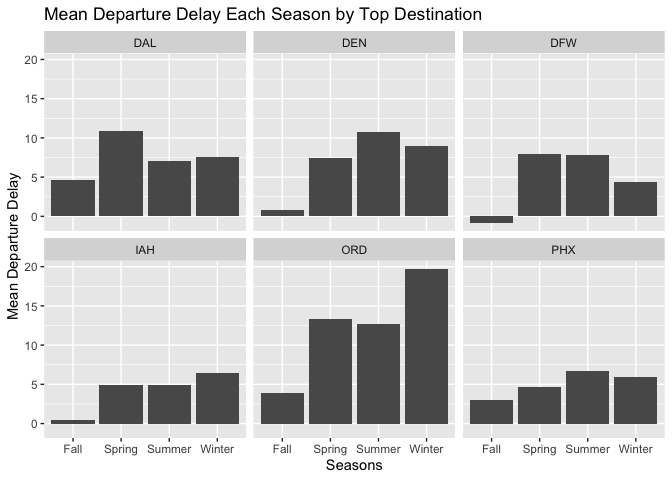

-   2A. Caption: The top 10 most popular song since 1958 as measured by
    the total number of weeks that a song spent on the Billboard
    Top 100.

Analysis: From the table, we see that Radioactive by Imagine Dragons is
highly popular. It stayed on Billboard Top 100 for 87 weeks. Sail,
Blinding Lights, and I’m Yours follow closely with the total number of
weeks spent on the Billboard top 100 equal to 79, 76, and 76
respectively.

    billboard <- read_csv("/Users/jirapat/Desktop/R/Data Mining/billboard.csv")

    ## Warning: Missing column names filled in: 'X1' [1]

    ## 
    ## ── Column specification ────────────────────────────────────────────────────────
    ## cols(
    ##   X1 = col_double(),
    ##   url = col_character(),
    ##   week_id = col_character(),
    ##   week_position = col_double(),
    ##   song = col_character(),
    ##   performer = col_character(),
    ##   song_id = col_character(),
    ##   instance = col_double(),
    ##   previous_week_position = col_double(),
    ##   peak_position = col_double(),
    ##   weeks_on_chart = col_double(),
    ##   year = col_double(),
    ##   week = col_double()
    ## )

    top_10 <- billboard %>% group_by(song, performer) %>% summarize(count = n()) %>% arrange(desc(count)) %>% head(10)

    ## `summarise()` has grouped output by 'song'. You can override using the `.groups` argument.

    top_10 <- apply_labels(top_10, song = "Song", count = "Total Number of Weeks", performer = "Performer")

-   2B. Caption: Line graph showing number of unique songs each year
    from 1959 to 2020.

Analysis: We see an increasing trend in musical diversity (as measured
by number of unique songs) during 1960 and reached its peak at 1965.
After that number of unique songs declined drastically and reached its
lowest value of 400 in the year 2000. Then, the trend rose exponentially
again until 2020.

    billboard_b <- billboard %>% filter(!year %in% c("1958", "2021")) %>% group_by(year) %>% mutate(unique_songs = n_distinct(song))

    billboard_diversity <- billboard_b %>% distinct(year, .keep_all = TRUE)

    ggplot(billboard_diversity, aes(x=year, y=unique_songs)) + geom_line() + xlab("year")

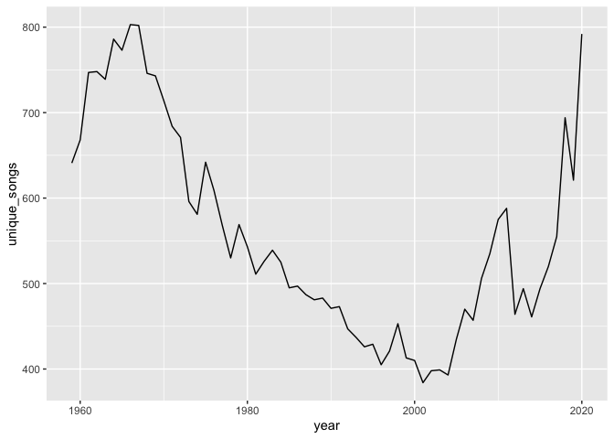

-   2C. Caption: The horizontal bar graph displays total number of song
    appeared on ten weeks hit for each 19 artists.

Analysis: Ten weeks hit is for the songs that appear on Billboard Top
100 for at least 10 weeks. There are 19 artists with at least 30 songs
on ten weeks hit. For example, Elton John had 52 songs on ten week hit,
meaning, each of the 52 songs was featured on Billboard Top 100 for at
least 10 weeks. Madonna had 44 songs on ten weeks hit followed by Kenny
Chesney who had 42 songs.

    ten_week_hit <- billboard %>% group_by(song, performer) %>% summarize(count = n()) %>% arrange(desc(count)) %>% filter(count >= 10) %>% group_by(performer) %>% count() %>% filter(n >= 30)

    ## `summarise()` has grouped output by 'song'. You can override using the `.groups` argument.

    ggplot(ten_week_hit, aes(x = performer, y = n)) + geom_col() + coord_flip()

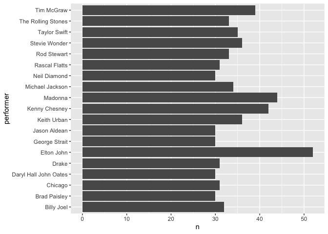

-   3A. The 95th percentile of heights for female across all Athletics
    events is 183 cm. This means that 95% of the height for female
    across all Athletics events is 183 cm. or lower.

<!-- -->

    olympics_top20 <- read_csv("/Users/jirapat/Desktop/R/Data Mining/olympics_top20.csv") 

    ## 
    ## ── Column specification ────────────────────────────────────────────────────────
    ## cols(
    ##   id = col_double(),
    ##   name = col_character(),
    ##   sex = col_character(),
    ##   age = col_double(),
    ##   height = col_double(),
    ##   weight = col_double(),
    ##   team = col_character(),
    ##   noc = col_character(),
    ##   games = col_character(),
    ##   year = col_double(),
    ##   season = col_character(),
    ##   city = col_character(),
    ##   sport = col_character(),
    ##   event = col_character(),
    ##   medal = col_character()
    ## )

    unique(olympics_top20$sport)

    ##  [1] "Ice Hockey"           "Gymnastics"           "Rowing"              
    ##  [4] "Football"             "Fencing"              "Athletics"           
    ##  [7] "Canoeing"             "Handball"             "Water Polo"          
    ## [10] "Wrestling"            "Sailing"              "Cycling"             
    ## [13] "Hockey"               "Swimming"             "Boxing"              
    ## [16] "Basketball"           "Volleyball"           "Cross Country Skiing"
    ## [19] "Equestrianism"        "Shooting"

    olympics_top20_parta <- olympics_top20 %>% filter(sex == "F" & sport == "Athletics")
    quantile(olympics_top20_parta$height, probs = 0.95)

    ## 95% 
    ## 183

-   3B. Rowing Women’s Coxed Fours had the greatest variability in
    competitor’s height as measured by standard deviation of 10.9.

<!-- -->

    olympics_top20 %>% filter(sex == "F") %>% group_by(event) %>% summarise(sd_height = sd(height)) %>% arrange(desc(sd_height)) %>% slice(c(1))

    ## # A tibble: 1 x 2
    ##   event                      sd_height
    ##   <chr>                          <dbl>
    ## 1 Rowing Women's Coxed Fours      10.9

-   3C.

-   How has the average age of Olympic swimmers changed over time? The
    trend for average age of Olympic swimmers fluctuated a lot
    since 1900. The average age rose from 18 in 1900 to 27 in 1912. Then
    the trend constantly declined and reached its low point at 18.5
    in 1976. After that, the trend took off and started to rise at a
    decreasing rate until 2016.

<!-- -->

    olympics_top20 %>% filter(sport == "Swimming") %>% group_by(year) %>% summarise(mean_age_swim = mean(age)) %>% ggplot(aes(x = year, y = mean_age_swim)) + geom_line()

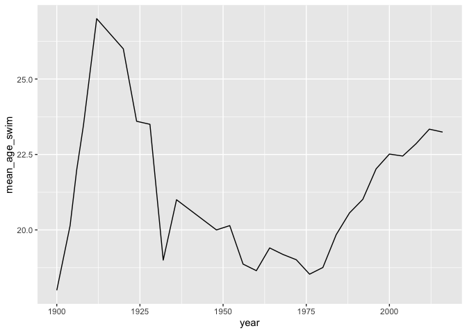

-   How has the average age of Olympic swimmers changed over time for
    Male? The trend of the average age for Olympic male swimmers reached
    its peak in the year 1924 with the value of 32 years old. Then the
    average age dropped drastically and reached its minimum in the year
    1932 with the value of 19 years old. After that, the trend has been
    rising slowly and reached the average age of 24.13 in the year 2016.

<!-- -->

    olympics_top20_male <- olympics_top20 %>% filter(sport == "Swimming") %>% filter(sex == "M") %>% group_by(year) %>% summarise(mean_age_swim = mean(age)) %>% ggplot(aes(x = year, y = mean_age_swim)) + geom_line()

    olympics_top20_male

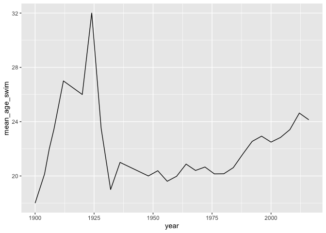

-   How has the average age of Olympic swimmers changed over time for
    Female? The trend for women, on the other hand, remained low
    until 1975. Then it rose drastically to reach its peak value of 22.5
    in 2000. After that, the average ages had been more or less constant
    at around 22 years old.

<!-- -->

    olympics_top20_female <- olympics_top20 %>% filter(sport == "Swimming") %>% filter(sex == "F") %>% group_by(year) %>% summarise(mean_age_swim = mean(age)) %>% ggplot(aes(x = year, y = mean_age_swim)) + geom_line()

    olympics_top20_female

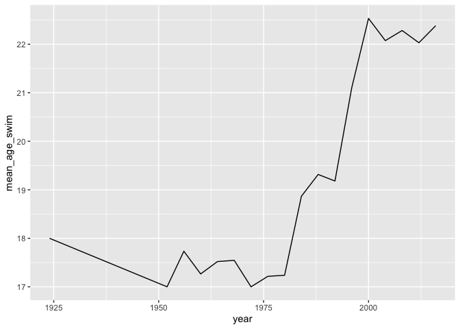

-   Does the trend look different for male swimmers relative to female
    swimmers? The trends for male and female differed substantially and
    seemed to show no correlation. The average age for male reached its
    peak in the year 1924 with the value of 32 years old. While the
    average ages for women was highest in 2000 with the value of 22.5.
    Overall, the trend of average ages for men declined over time. On
    the contrary, the trend rose over time for women

<!-- -->

    olympics_top20 %>% filter(sport == "Swimming") %>% group_by(sex, year) %>% summarise(mean_age = mean(age)) %>% ggplot(aes(x = year, y = mean_age, colour = sex)) + geom_line()

    ## `summarise()` has grouped output by 'sex'. You can override using the `.groups` argument.

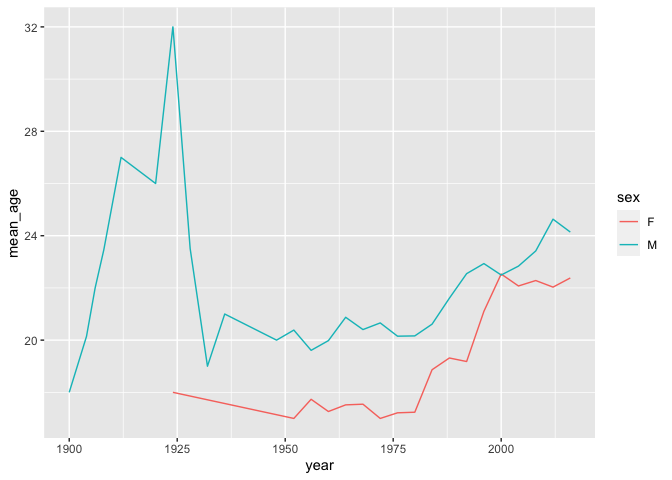

-   4

<!-- -->

    sclass <- read_csv("/Users/jirapat/Desktop/R/Data Mining/sclass.R")

    ## 
    ## ── Column specification ────────────────────────────────────────────────────────
    ## cols(
    ##   id = col_double(),
    ##   trim = col_character(),
    ##   subTrim = col_character(),
    ##   condition = col_character(),
    ##   isOneOwner = col_logical(),
    ##   mileage = col_double(),
    ##   year = col_double(),
    ##   color = col_character(),
    ##   displacement = col_character(),
    ##   fuel = col_character(),
    ##   state = col_character(),
    ##   region = col_character(),
    ##   soundSystem = col_character(),
    ##   wheelType = col_character(),
    ##   wheelSize = col_character(),
    ##   featureCount = col_double(),
    ##   price = col_double()
    ## )

    mercedes = sclass

    mercedes_350 = mercedes %>% filter(trim == '350')

    summary(mercedes_350)

    ##        id            trim             subTrim           condition        
    ##  Min.   :  282   Length:416         Length:416         Length:416        
    ##  1st Qu.:14290   Class :character   Class :character   Class :character  
    ##  Median :26658   Mode  :character   Mode  :character   Mode  :character  
    ##  Mean   :26520                                                           
    ##  3rd Qu.:39599                                                           
    ##  Max.   :52220                                                           
    ##  isOneOwner         mileage            year         color          
    ##  Mode :logical   Min.   :     6   Min.   :1994   Length:416        
    ##  FALSE:310       1st Qu.: 19264   1st Qu.:2006   Class :character  
    ##  TRUE :106       Median : 29998   Median :2012   Mode  :character  
    ##                  Mean   : 42926   Mean   :2010                     
    ##                  3rd Qu.: 63479   3rd Qu.:2012                     
    ##                  Max.   :173000   Max.   :2013                     
    ##  displacement           fuel              state              region         
    ##  Length:416         Length:416         Length:416         Length:416        
    ##  Class :character   Class :character   Class :character   Class :character  
    ##  Mode  :character   Mode  :character   Mode  :character   Mode  :character  
    ##                                                                             
    ##                                                                             
    ##                                                                             
    ##  soundSystem         wheelType          wheelSize          featureCount   
    ##  Length:416         Length:416         Length:416         Min.   :  0.00  
    ##  Class :character   Class :character   Class :character   1st Qu.: 31.75  
    ##  Mode  :character   Mode  :character   Mode  :character   Median : 54.00  
    ##                                                           Mean   : 49.22  
    ##                                                           3rd Qu.: 70.00  
    ##                                                           Max.   :112.00  
    ##      price       
    ##  Min.   :  6600  
    ##  1st Qu.: 19401  
    ##  Median : 52900  
    ##  Mean   : 46854  
    ##  3rd Qu.: 61991  
    ##  Max.   :106010

    # plot the data
    ggplot(data = mercedes_350) + 
      geom_point(mapping = aes(x = mileage, y = price), color='darkgrey')

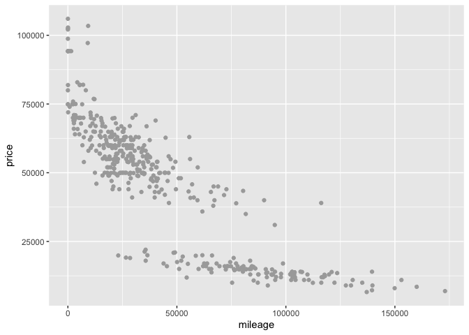

    # test train split
    mercedes_350_split = initial_split(mercedes_350, prop=0.8)
    mercedes_350_train = training(mercedes_350_split)
    mercedes_350_test  = testing(mercedes_350_split)

    k_grid = c(2, 4, 6, 8, 10, 15, 20, 25, 30, 35, 40, 45,
               50, 60, 70, 80, 90, 100)

    k_grid = seq(2,100, by=1)

    cv_350_grid = foreach(k = k_grid, .combine='rbind') %dopar% {
      knn = knnreg(price ~ mileage, data=mercedes_350_train, k=k)
      rms = rmse(knn, mercedes_350_test)
      c(k=k, err=rms)
    } %>% as.data.frame

    ## Warning: executing %dopar% sequentially: no parallel backend registered

    head(cv_350_grid)

    ##          k      err
    ## result.1 2 12471.60
    ## result.2 3 11795.42
    ## result.3 4 11011.09
    ## result.4 5 10662.62
    ## result.5 6 10669.50
    ## result.6 7 10725.83

    ggplot(cv_350_grid) + 
      geom_point(aes(x=k, y=err))

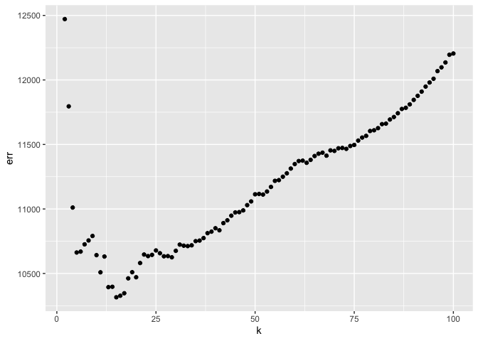

      scale_x_log10()

    ## <ScaleContinuousPosition>
    ##  Range:  
    ##  Limits:    0 --    1

    cv_grid_output = cv_350_grid %>% filter(err == min(cv_350_grid$err))
    cv_grid_output$k

    ## [1] 15

    knn = knnreg(price ~ mileage, data=mercedes_350_train, k=cv_grid_output$k)

    mercedes_350_test = mercedes_350_test %>%
      mutate(price_350_pred = predict(knn, mercedes_350_test))

    pred_350_test = ggplot(data = mercedes_350_test) + 
      geom_point(mapping = aes(x = mileage, y = price), alpha=0.2)
    pred_350_test

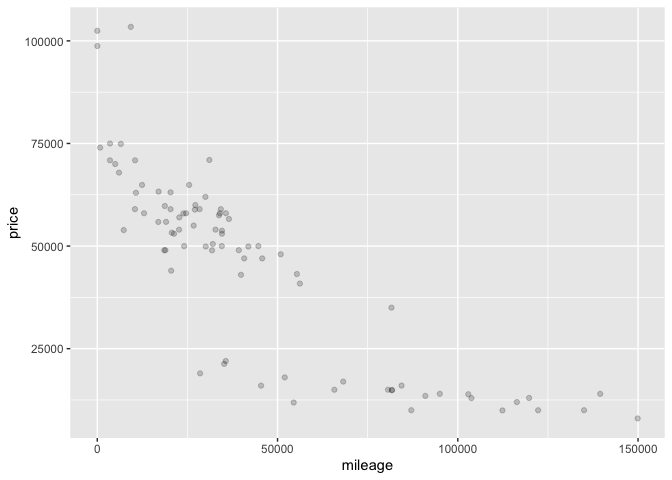

    pred_350_test + geom_line(aes(x = mileage, y = price_350_pred), color='red', size=1.5)

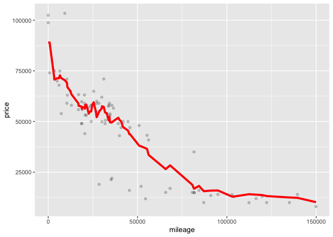

    mercedes_65 = mercedes %>% filter(trim == '65 AMG')

    summary(mercedes_65)

    ##        id            trim             subTrim           condition        
    ##  Min.   : 1060   Length:292         Length:292         Length:292        
    ##  1st Qu.:13977   Class :character   Class :character   Class :character  
    ##  Median :26557   Mode  :character   Mode  :character   Mode  :character  
    ##  Mean   :26444                                                           
    ##  3rd Qu.:38687                                                           
    ##  Max.   :52326                                                           
    ##  isOneOwner         mileage            year         color          
    ##  Mode :logical   Min.   :     1   Min.   :2006   Length:292        
    ##  FALSE:254       1st Qu.:    20   1st Qu.:2007   Class :character  
    ##  TRUE :38        Median : 28803   Median :2010   Mode  :character  
    ##                  Mean   : 33700   Mean   :2010                     
    ##                  3rd Qu.: 58496   3rd Qu.:2015                     
    ##                  Max.   :146975   Max.   :2015                     
    ##  displacement           fuel              state              region         
    ##  Length:292         Length:292         Length:292         Length:292        
    ##  Class :character   Class :character   Class :character   Class :character  
    ##  Mode  :character   Mode  :character   Mode  :character   Mode  :character  
    ##                                                                             
    ##                                                                             
    ##                                                                             
    ##  soundSystem         wheelType          wheelSize          featureCount   
    ##  Length:292         Length:292         Length:292         Min.   :  0.00  
    ##  Class :character   Class :character   Class :character   1st Qu.: 17.00  
    ##  Mode  :character   Mode  :character   Mode  :character   Median : 58.00  
    ##                                                           Mean   : 48.09  
    ##                                                           3rd Qu.: 72.00  
    ##                                                           Max.   :112.00  
    ##      price       
    ##  Min.   : 18990  
    ##  1st Qu.: 48711  
    ##  Median : 79994  
    ##  Mean   :117121  
    ##  3rd Qu.:225975  
    ##  Max.   :247075

    ggplot(data = mercedes_65) + 
      geom_point(mapping = aes(x = mileage, y = price), color='darkgrey')

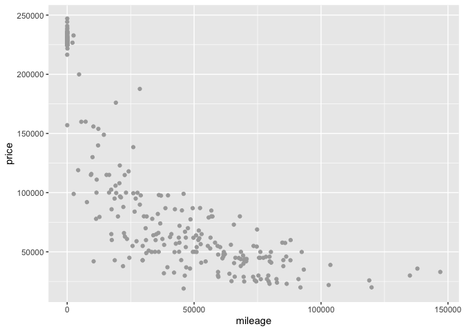

    mercedes_65_split = initial_split(mercedes_65, prop=0.8)
    mercedes_65_train = training(mercedes_65_split)
    mercedes_65_test  = testing(mercedes_65_split)

    k_grid = c(2, 4, 6, 8, 10, 15, 20, 25, 30, 35, 40, 45,
               50, 60, 70, 80, 90, 100)

    k_grid = seq(2,100, by=1)

    cv_65_grid = foreach(k = k_grid, .combine='rbind') %dopar% {
      knn = knnreg(price ~ mileage, data=mercedes_65_train, k=k)
      rms = rmse(knn, mercedes_65_test)
      c(k=k, err=rms)
    } %>% as.data.frame

    head(cv_65_grid)

    ##          k      err
    ## result.1 2 23058.49
    ## result.2 3 19901.86
    ## result.3 4 19138.11
    ## result.4 5 19488.71
    ## result.5 6 19521.38
    ## result.6 7 19155.45

    ggplot(cv_65_grid) + 
      geom_point(aes(x=k, y=err))

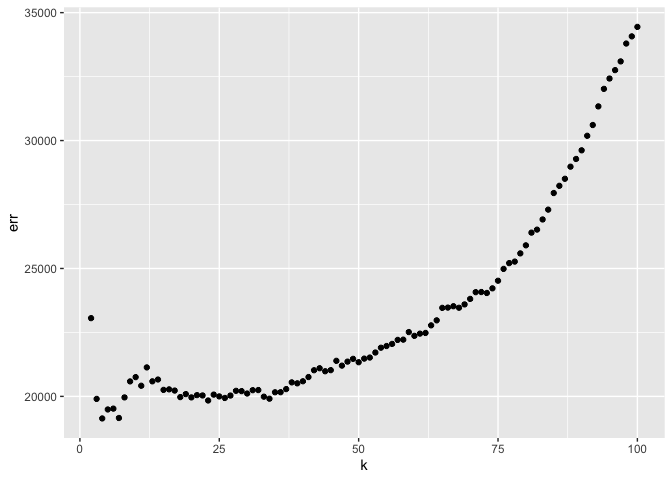

      scale_x_log10()

    ## <ScaleContinuousPosition>
    ##  Range:  
    ##  Limits:    0 --    1

    cv_grid_output = cv_65_grid %>% filter(err == min(cv_65_grid$err))
    cv_grid_output$k

    ## [1] 4

    knn = knnreg(price ~ mileage, data=mercedes_65_train, k=cv_grid_output$k)

    mercedes_65_test = mercedes_65_test %>%
      mutate(price_65_pred = predict(knn, mercedes_65_test))

    pred_65_test = ggplot(data = mercedes_65_test) + 
      geom_point(mapping = aes(x = mileage, y = price), alpha=0.2)
    pred_65_test

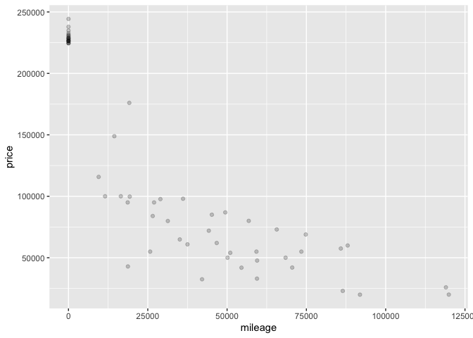

    pred_65_test + geom_line(aes(x = mileage, y = price_65_pred), color='red', size=1.5)

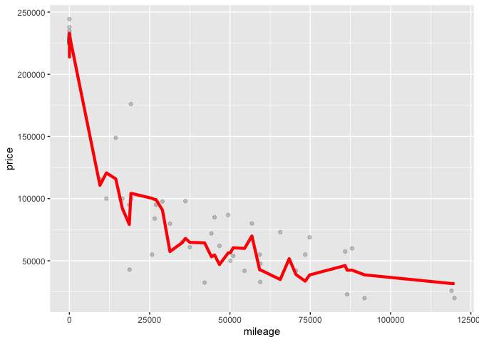 \* Which
trim yields a larger optimal value of K? – trim = 350 yields a larger
optimal k

Why do you think this is? The sample size for trim = 350 is higher than
that for trim = 65. If we have larger sample size, we can afford higher
k without the bias being too high. This is because you’re averaging the
points around the neighbourhood. This is about bias-variance tradeoff.
On the contrary, if you have small sample size, you’re averaging the
data points further away, causing the bias to be high.
